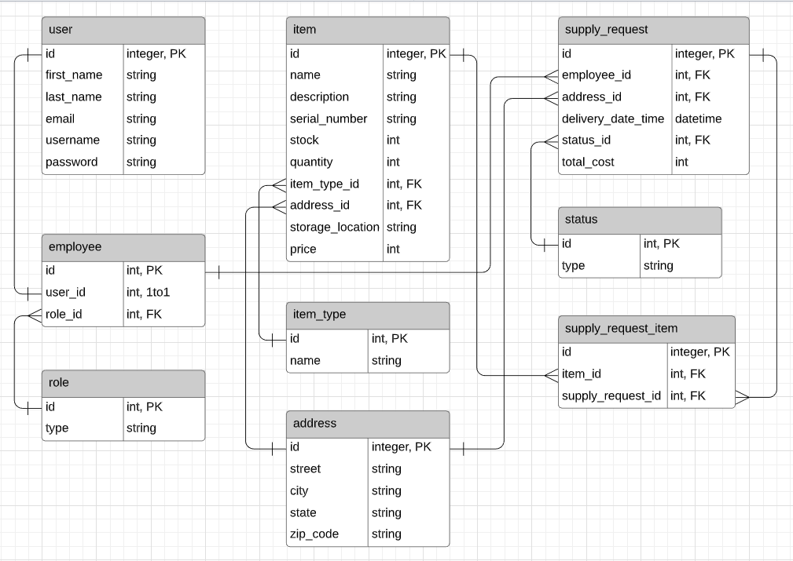

# SupplyMate Client (Nashville Software School final project)

SupplyMate is an inventory and logistics management system. It was designed as a tool for companies that maintain an inventory and also have employees pulling from that inventory. No more emails, phone calls, text messages, spreadsheets. SupplyMate streamlines the whole process.

## Setup

- You will need NPM for this as it is a react application. You can get NPM here https://www.npmjs.com/get-npm.
- From your terminal, clone down this repository and `cd` into the project directory.
- Run `npm install` and wait for all the dependencies to be installed.
- `cd` into `src/` and run `npm start`. This will start the front-end portion of the application. If you have not done so yet, make sure you setup the back-end as well. https://github.com/chase-fite/supplymate-api

## Usage

- A user can register as either a logistics or remote employee.
- Logistics employees manage the inventory and supply requests. They can add, remove, or update items. They can also approve, cancel, or modify supply requests.
- Remote employees can create supply requests, selecting items and quantities directly from the inventory. They can also approve or cancel modified supply requests.

## ERD

